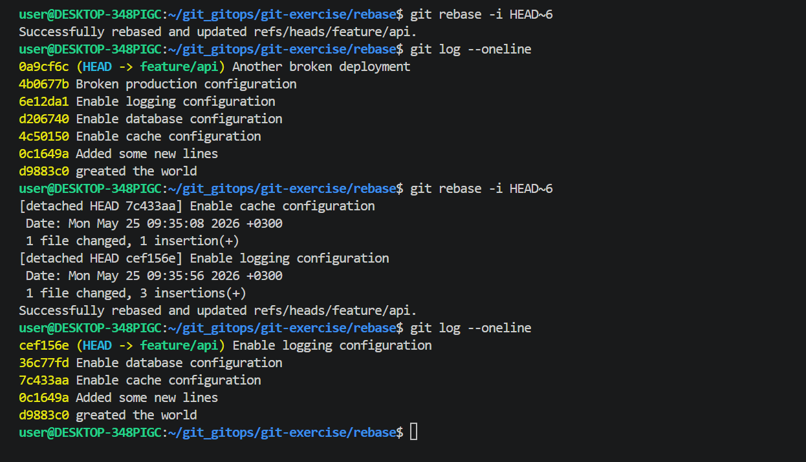
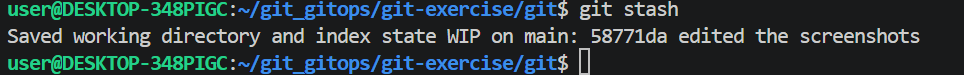
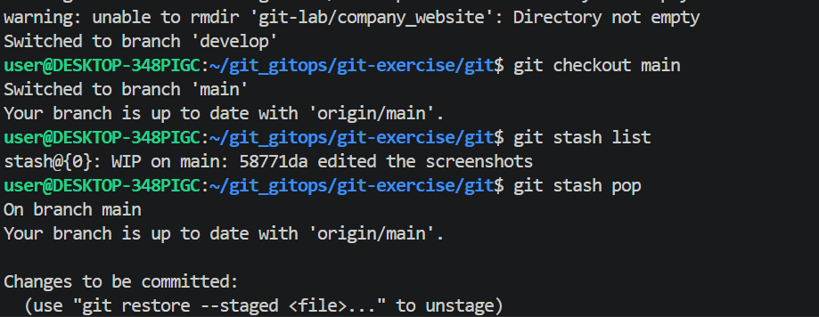
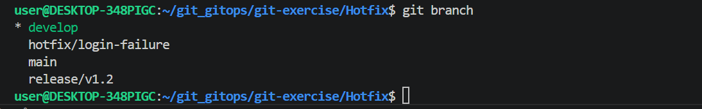

# Git-Exercises

# 1. Multi-Branch Feature Intergration challenge

A team is building a cloud optimization dashboard.
you must create: feature login,dashboard and reports.
each branch should contain different files and atleast 3 commits. Merge all branches into develop, finally merge develop into main.

In the image below we can see that we have four branches.

In the feature/login branch we created three files login1, login2 and login3

 

we created three commits in the login branch.

In the feature/dashboard branch we created 3 files, dashboard1, dashboard2 and dashboard3

"git logs" shows feature/dashboard has three commits

In the reports branch we created 3 files , reports1, reports2 and report3

The feature/reports branch has three commits

We merge all the branches to develop branch.

On the develops branch we did listing and all the files from all the branches are there as we can see.

We merged the develop branch to main branch, As we can see, the main branch contains all the files from all the branches now.

# 2. Two Students Edit Same Line (Conflict Lab)

Two students edit the same cofiguration line in congig/app.env
Student A changes: 
APP_MODE=development
Student B changes:
APP_MODE=production

We created congig/app.env file in the dashboard and reports branches they both contained the APP_MODE=production and APP_MODE=development.

when we tried to merge, we can see we created a conflict because the app.env file in the two branches have different content that are somewhat similar and git doesnt know which data to keep, so it creates the conflict.

To resolve this conflict we have to edit one of the file to something else
for our case we combined both.

# 3. Recover From Disaster(Reset vs Revert)

A bad deployment was pushed to production

here have 5 commits and we did git revert

The git revert did not delete the last commit but it added a new commit

we created another commit with which we did the git reset --soft HEAD~1  on

We can see that this time the commit got deleted but when you do git status files changes remain staged.

We did another commit and we used git reset --hard HEAD~1 this time we removed the commit as we can see the git status, the staged changes were also removed, the working directory changes deleted permanently..

The difference between git revert, git reset --soft and git reset --hard is that git revert does not delete the commits but adds a new commit, git reset --soft , removes the commits but does not remove it from the staging face, git reset --hard removes the commit permanently,from the staging,and the working directory.

# 4. Simulated Team Collaboration Workflow.

We used a repository called JosephKimiri, we forked it to make a copy to our repository so we can make changes.

we copied the url to that forked repository.

After that we git cloned the repo to our local repo, we can see that josephkimiri has been cloned to our local repository.

we created a feature branch feature/timer.

we created file on the feature branch and we have to push the changes to the remote repo.

after pushing on the git repository this is what we have, to pull and compare 

we added a comment to our pull request

we created a ruleset for the github repository.

# 5. Git Rebase vs Merge History Lab

This lab we created 7 commits that were messy and then used rebase to squash some commits ie combined some commits.and rewrote others

Merge  Workflow

Combines branches, a merge commit may be created.
with merge keeps complete project history, it is safer for teams because history is not rewritten, it is easier to trace when branches were merged.

Rebase Workflow

git rebase creates a cleaner liner history, its easier to read ans review, reduces unnecessary merge commits.

merge=preserves history
rebase=rewrites history for cleanliness

# 6. Emergency Hotfix Production Scenario

we created the branches
 

# 7. Stash and Context Switching Excercise

You are halfway through feature development when an urgent bug arrives.

To save unfinished work instead of commiting we stash so we can come back later, but we have to stage the files first.
We switched to different branch, where we did our work and switched back to the branch with stashed work.

# 8. Accidental Secret Exposure Recovery

A developer accidentally commits:
● API keys
● passwords
● .env file

we created a .env file

we committed the .env file with secrets. with the secrets exposed, anyone with repository access may retrieve them,even if the file is deleted later, git history still contains it.

to avoid such occurences, we removed current tracking

git rm --chached .env this keep the local file but stop tracking it. we then commit the removal.

# note: after that we regenrate new keys and change passwords 

.gitignore file is a plain text file used to tell Git which files or directories should be ignored and excluded from being tracked in your project history.

we created a .gitignore file and committed.

deleting the file normally is NOT enough because the secrets remain in old commits.

